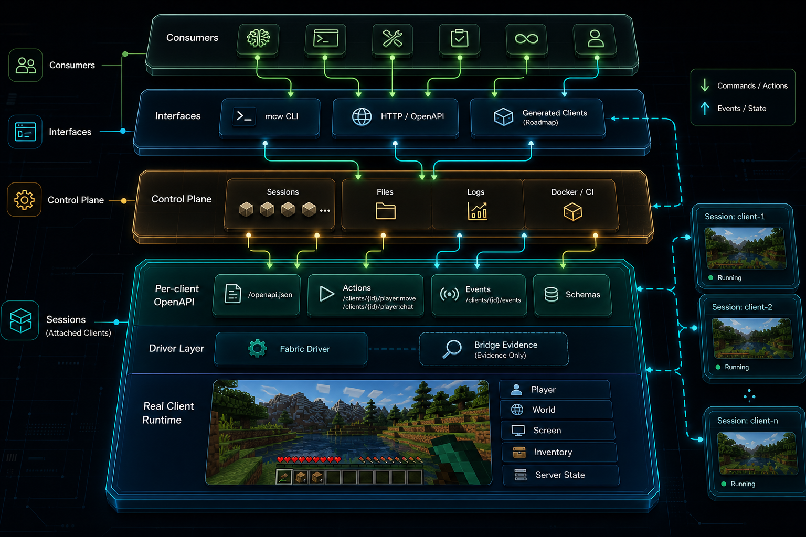

# Craftless


Craftless is automation infrastructure for real Minecraft Java clients,
headless or visible.

It launches or attaches to real clients and gives agents, tools, tests, and CI
a generated local API for inspecting and controlling Minecraft through the same
client runtime players use. Run clients headlessly for unattended automation,
or keep the game window visible so humans can watch and debug what is
happening.

Craftless is not Mineflayer and is not a protocol-only bot. It controls the
real Minecraft client process while hiding loader, version, mapping, mod, and
driver internals behind stable Craftless-owned contracts.

If you know Browserless, Craftless fills a similar role for Minecraft:
Browserless turns real browsers into programmable automation infrastructure;
Craftless does that for real Minecraft Java clients, with live API discovery
instead of a static list of hard-coded actions.

## How It Fits Together

Minecraft already provides the client runtime. Craftless adds a thin driver,
runtime, and protocol layer around that real client.



Craftless keeps the control plane deliberately split:

- `GET /openapi.json` is the stable supervisor API for lifecycle, client
  creation, events, and per-client spec discovery.
- `GET /clients/{id}/openapi.json` is the generated live API for one running
  client. It owns gameplay actions, generated aliases, schemas, availability,
  and runtime fingerprints for that exact client.
- `GET /clients/{id}/actions` is a projection of the per-client OpenAPI action
  metadata for discovery and filtering, not a separate source of truth.
- `GET /clients/{id}/resources` is a projection of the same live actions into
  Craftless-owned resource ids such as `player`, `inventory`, and
  `world.block`.
- `craftless` and future generated clients fetch those specs at runtime. They
  do not keep a hand-written catalog of Minecraft gameplay commands.

## Example

Start with the current `craftless` CLI, then use the generated local API it exposes.
The target product and CLI name is Craftless. Each
client has its own live OpenAPI document because available actions can depend
on the running Minecraft version, loader, mods, registries, server features,
permissions, and driver runtime.

```sh
# Prepare repeatable cache handles for the Minecraft/Fabric setup state.
# This resolves and stores Minecraft version metadata under the workspace.
craftless cache prepare --mc 1.21.6 --loader fabric --workspace .craftless

# Start the local Craftless supervisor API with a repeatable client workspace.
craftless server start --port 8080 --workspace .craftless
```

```sh
CRAFTLESS=http://127.0.0.1:8080

# Create a daemon-managed client session.
curl -sS "$CRAFTLESS/clients" \
  -H 'content-type: application/json' \
  -d '{
    "id": "alice",
    "version": "1.21.6",
    "loader": "FABRIC",
    "profile": { "kind": "OFFLINE", "name": "Alice" }
  }'

# List or fetch stable lifecycle state from the kernel API.
curl -sS "$CRAFTLESS/clients"
curl -sS "$CRAFTLESS/clients/alice"

# Connect the client through the lifecycle API.
curl -sS "$CRAFTLESS/clients/alice:connect" \
  -H 'content-type: application/json' \
  -d '{"host":"localhost","port":25565}'

# Discover the generated API for that exact client.
curl -sS "$CRAFTLESS/clients/alice/openapi.json"
curl -sS "$CRAFTLESS/clients/alice/resources"

# Run actions through the generic action endpoint described by that API.
curl -sS "$CRAFTLESS/clients/alice:run" \
  -H 'content-type: application/json' \
  -d '{"action":"player.chat","args":{"message":"hello from Craftless"}}'

curl -sS "$CRAFTLESS/clients/alice:run" \
  -H 'content-type: application/json' \
  -d '{"action":"player.move","args":{"forward":true,"ticks":20}}'
```

## Automation Comparison

Legend: 🟢 yes, 🟡 partial or limited, 🔵 planned, 🔴 no.

| Area | Craftless | [Mineflayer](https://github.com/PrismarineJS/mineflayer) | [Baritone](https://github.com/cabaletta/baritone) |
| --- | --- | --- | --- |
| Real Minecraft Java client | 🟢 Fabric smoke proven for join/chat plus driver-side movement event | 🔴 protocol bot | 🟢 |
| Headless and visible operation | 🟡 supervisor API now; visible Fabric smoke proven | 🔴 | 🟡 visible client |
| Live per-client OpenAPI/action schema | 🟢 | 🔴 | 🔴 |
| Runtime discovery from version, mods, server features, and permissions | 🟢 | 🟡 protocol data | 🟡 in-client state |
| Stable automation surface for agents and generated clients | 🟢 | 🟡 library API | 🟡 Java API |
| Movement/pathfinding depth | 🟡 generated movement action; pathfinding roadmap | 🟢 | 🟢 |
| Inventory, screen, perception, and world queries | 🟡 player query, raycast, inventory, and block bindings started | 🟢 | 🟡 pathing-focused |
| Multi-client local supervisor | 🟡 in-memory API now | 🔴 | 🔴 |
| Minecraft version support model | 🔵 stable API; Fabric driver/mappings paced | 🟡 protocol matrix | 🟡 versioned builds |
| Best fit | Real-client automation infrastructure | Fast bot scripts | In-game pathfinding |

The comparison is based on upstream project docs. Mineflayer is strongest for
protocol-visible bot APIs, while Baritone is strongest for in-client
pathfinding. Craftless support is paced by Fabric driver bindings,
mappings/accessors, and real-client smoke validation rather than by a static
protocol matrix alone.

## Status

Implemented now:

- Kotlin/JVM Gradle project with `protocol`, `daemon`, `driver-api`,
  `driver-runtime`, `driver-fabric`, `cli`, `testkit`, and Playwright helper
  modules.
- `craftless` CLI with a small static core plus adaptive per-client action
  aliases and help loaded from action metadata.
- Ktor local supervisor API with stable kernel OpenAPI at `/openapi.json`.
- Per-client OpenAPI at `/clients/{id}/openapi.json` with Craftless metadata,
  action schemas, resource projections, source/availability metadata, and
  runtime/cache fingerprints.
- Stable lifecycle routes for creating, listing, fetching, connecting, and
  stopping daemon-managed clients.
- Client responses include a Craftless-owned instance file layout for the
  instance root, game root, mods, config, saves, resource packs, and shader
  packs.
- Fabric/Loom driver module with internal version-aware bindings and
  gateway-backed runtime hooks for current action evidence.
- Fabric-generated action descriptors for current chat, movement, player query,
  raycast, inventory query/equip, and block-break bindings, routed through an
  internal discovery projection. Broader gameplay actions are not advertised
  until they come from real bindings or runtime discovery probes with
  machine-readable availability reasons.
- Testkit helpers and an opt-in `:testkit:localMinecraftServerSmoke` task for
  provisioning a Minecraft server jar, accepting the EULA, starting the server,
  keeping it running around a caller-supplied smoke action, and collecting
  server log evidence.
- An opt-in `:driver-fabric:fabricClientSmoke` entrypoint that launches a real
  Minecraft `1.21.6` Fabric client, keeps a local testkit Minecraft server
  alive, starts the in-client daemon API, fetches per-client OpenAPI/action
  metadata and resource projections, invokes generated `player.chat`,
  `player.move`, `player.query`, `inventory.query`, `inventory.equip`, and
  `world.block.break` through `POST /clients/{id}:run`, and verifies
  server-side join, chat, and disconnect evidence plus driver-side movement and
  gameplay result artifacts.

Still roadmap:

- stronger real-client movement proof using server-side position deltas or
  richer measured in-client position telemetry;
- runtime discovery/projection for broader gameplay resources and actions such
  as look, world/entity queries, screen interaction, crafting, richer handles,
  and events;
- consolidated Fabric driver support across more Minecraft versions;
- fuller client file management informed by Prism Launcher source, with any
  Prism import/adapter remaining optional rather than a core dependency.

## Design Docs

- `docs/product-positioning.md`
- `docs/bridge-limitations.md`
- `docs/client-file-management.md`
- `docs/agent-skills.md`
- `docs/roadmap.md`

Historical planning and evidence notes live under `docs/superpowers/`. They are
kept for traceability; the README status and current docs above describe the
active architecture.

## Development

Install and run pinned tools through `mise`:

```sh
mise install
mise run ci
mise run lint
mise run architecture-check
mise run lint-fix
mise exec -- gradle test
```

`mise run lint` runs ktlint, detekt, and Kotlin compilation with warnings
treated as errors.
`mise run architecture-check` runs the focused protocol, daemon, CLI, Fabric,
and Bun helper checks that guard the live OpenAPI/action architecture.

Use Bun for Playwright helper tests:

```sh
mise exec -- bun test playwright
```

Opt into the local Minecraft server smoke only when network downloads and a
real server process are acceptable:

```sh
CRAFTLESS_LOCAL_SERVER_SMOKE=1 mise exec -- gradle :testkit:localMinecraftServerSmoke
```

The Fabric client smoke is also opt-in:

```sh
CRAFTLESS_FABRIC_CLIENT_SMOKE=1 mise exec -- gradle :driver-fabric:fabricClientSmoke
```

Override the client command with `CRAFTLESS_SMOKE_ACTION_COMMAND_JSON`, encoded
as a JSON string array, when testing a different launch wrapper. The in-client
Fabric smoke controller reads `CRAFTLESS_SMOKE_SERVER_HOST`,
`CRAFTLESS_SMOKE_SERVER_PORT`, `CRAFTLESS_FABRIC_SMOKE_CHAT_MESSAGE`, and
`CRAFTLESS_FABRIC_SMOKE_CONNECT_TIMEOUT_MS`. Evidence checks can be overridden
with `CRAFTLESS_SMOKE_EXPECT_PLAYER`, `CRAFTLESS_SMOKE_EXPECT_CHAT_MESSAGE`,
and `CRAFTLESS_SMOKE_EXPECT_DISCONNECT`.

That task is opt-in and not part of default CI because it launches real
Minecraft processes and may download server/client artifacts.
