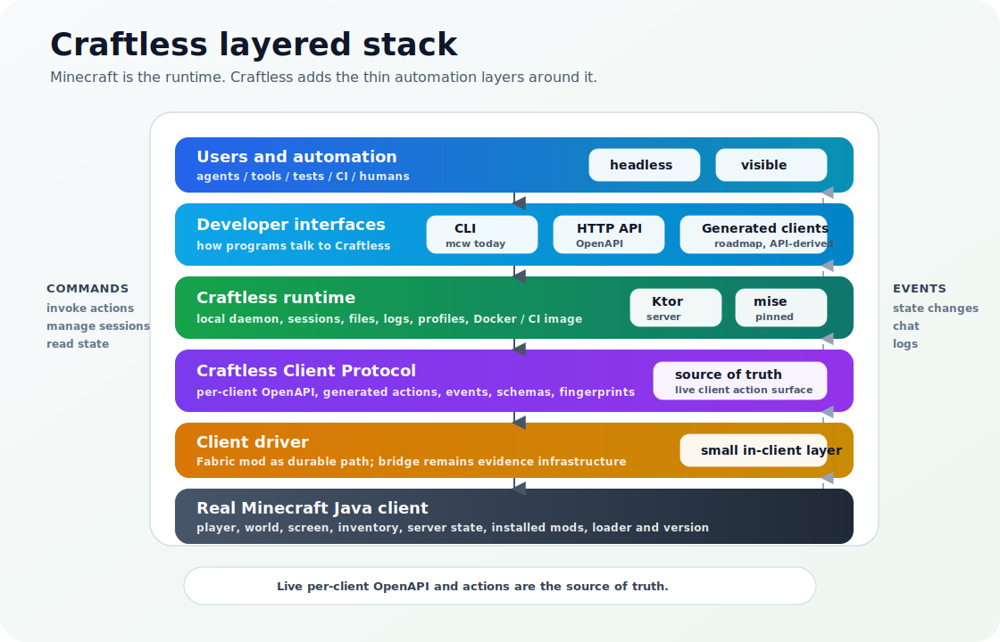

# Craftless

Craftless is automation infrastructure for real Minecraft Java clients,
headless or visible.

It launches or attaches to real clients and gives agents, tools, tests, and CI
a generated local API for inspecting and controlling Minecraft through the same
client runtime players use. Run clients headlessly for unattended automation,
or keep the game window visible so humans can watch and debug what is
happening.

Craftless is not Mineflayer and is not a protocol-only bot. It controls the
real Minecraft client process while hiding loader, version, mapping, mod, and
driver internals behind stable Craftless-owned contracts.

If you know Browserless, Craftless fills a similar role for Minecraft:
Browserless turns real browsers into programmable automation infrastructure;
Craftless does that for real Minecraft Java clients, with live API discovery
instead of a static list of hard-coded actions.

## How It Fits Together

Minecraft already provides the client runtime. Craftless adds a thin driver,
runtime, and protocol layer around that real client.



## Example

Start with the current `mcw` CLI, then use the generated local API it exposes.
The target product and CLI name is Craftless. Each
client has its own live OpenAPI document because available actions can depend
on the running Minecraft version, loader, mods, registries, server features,
permissions, and driver runtime.

```sh
# Start the local Craftless supervisor API.
mcw clients api --port 8080
```

```sh
CRAFTLESS=http://127.0.0.1:8080

# Create a real client session.
curl -sS "$CRAFTLESS/clients" \
  -H 'content-type: application/json' \
  -d '{
    "id": "alice",
    "version": "1.21.4",
    "loader": "FABRIC",
    "profile": { "kind": "OFFLINE", "name": "Alice" }
  }'

# List or fetch stable lifecycle state from the kernel API.
curl -sS "$CRAFTLESS/clients"
curl -sS "$CRAFTLESS/clients/alice"

# Connect the client through the lifecycle API.
curl -sS "$CRAFTLESS/clients/alice:connect" \
  -H 'content-type: application/json' \
  -d '{"host":"localhost","port":25565}'

# Discover the generated API for that exact client.
curl -sS "$CRAFTLESS/clients/alice/openapi.json"

# Run actions through the generic action endpoint described by that API.
curl -sS "$CRAFTLESS/clients/alice:run" \
  -H 'content-type: application/json' \
  -d '{"action":"player.chat","args":{"message":"hello from Craftless"}}'

curl -sS "$CRAFTLESS/clients/alice:run" \
  -H 'content-type: application/json' \
  -d '{"action":"player.move","args":{"forward":true,"ticks":20}}'
```

## Status

Craftless is a Kotlin/JVM-first project with one implementation direction:

- a short scriptable CLI, currently `mcw` unless renamed separately, with a
  small static core plus adaptive per-client action aliases and help loaded
  from OpenAPI and action descriptors at runtime;
- a local supervisor/API for client sessions;
- a stable JVM `driver-api` contract with a fake implementation for daemon and
  route integration and runtime action metadata;
- a `driver-runtime` adapter layer that can run `DriverSession` over bridge or
  Fabric-style backends without changing daemon routes;
- a compiled Fabric/Loom driver module, currently still named
  `driver-fabric-1_21_6` while the codebase consolidates toward one
  `driver-fabric` module with internal version-aware bindings, mod metadata,
  mixin config, and a gateway-backed runtime backend for client-thread connect,
  chat, command, stop, and generated `player.move`/`player.chat` action
  invocation;
- a temporary HeadlessMC/HMC-Specifics bridge backend for Phase 1 evidence;
- a real Fabric driver implementation as the durable automation engine;
- stable kernel OpenAPI at `/openapi.json` plus per-client OpenAPI at
  `/clients/{id}/openapi.json` with Craftwright metadata and discovered
  action schemas plus runtime/cache fingerprints;
- stable kernel lifecycle routes for creating, listing, fetching, connecting,
  and stopping daemon-managed clients;
- Playwright helper tests.

## Evidence

A throwaway real-client PoC was built under `/tmp/craftwright-real-client-poc`.
It proved the core loop:

1. start a local offline Paper 1.21.4 server;
2. launch a real Minecraft Java client through HeadlessMC;
3. load Fabric 1.21.4 and HMC-Specifics 2.4.0;
4. expose a local HTTP API wrapper;
5. connect the real client to the server;
6. invoke `player.chat` and `player.move` actions through API calls;
7. verify join, chat, and position change from the server.

Observed server evidence:

```text
CwApiBot joined the game
<CwApiBot> api action after reconnect
CwApiBot has the following entity data: [-5.5d, -60.0d, 10.914621337840606d]
```

This was a bridge PoC. It used HMC-Specifics commands behind a
Craftwright-shaped API. That is good enough to prove the launch/control loop,
but not good enough as the final product driver.

The final driver should be a Fabric mod that directly implements movement,
look direction, raycasts, nearby block/entity perception, inventory, screen
state, interactions, chat, and lifecycle events from inside the Minecraft
client.

## Roadmap

Phase 1:

- extend the Kotlin/JVM Gradle project skeleton;
- implement the CLI and local API surface;
- keep CLI action commands adaptive: `mcw` may expose generic
  `clients <id> run <action>` plus aliases such as `clients <id> player move`,
  but those aliases and their basic help come from the target client's
  OpenAPI/action metadata instead of static Kotlin commands;
- route daemon-created clients through an injectable driver runtime boundary;
- keep the current Fabric module compiling under Loom while consolidating
  version-specific code behind internal driver bindings instead of one public
  subproject per Minecraft version;
- route Fabric connect, chat, command, stop, and generated
  `player.move`/`player.chat` action invocation through a real Minecraft
  client gateway;
- expose `/clients/{id}/openapi.json` with runtime fingerprint metadata and
  discovered action schemas while avoiding static hand-written action route
  expansion;
- expose AIP-style action invocation through `POST /clients/{id}:run` plus
  generated aliases such as `POST /clients/{id}/player:move` and
  `POST /clients/{id}/player:chat`;
- accept action invocation arguments as typed JSON values such as
  `{"action":"player.move","args":{"forward":true,"ticks":20}}` and
  `{"action":"player.chat","args":{"message":"hello"}}`, with alias routes
  accepting the direct args body such as `{"message":"hello"}`;
- add a temporary HeadlessMC/HMC-Specifics bridge backend;
- add a real integration smoke test that launches a real client, joins a
  server, invokes `player.chat` and `player.move`, and verifies server-side
  position changed;
- keep public API names independent from HMC-Specifics command strings.

Phase 2:

- expand generated actions for look/perception beyond the current
  `player.move` movement intent;
- move more runtime/version/mod/registry inputs into per-client OpenAPI
  fingerprints and binding support checks;
- expose generated/discovered roots such as player, world, screen, and events
  when described by the per-client OpenAPI document, with action schemas for
  movement, look, raycast, inventory, world/entity queries, and screen
  interaction.

Later:

- expand Playwright and Vitest fixtures;
- compatibility rows for additional Minecraft versions through the consolidated
  Fabric driver where possible;
- optional PrismLauncher import/adapter work.

## Design Docs

Current docs:

- `docs/superpowers/specs/2026-06-25-jvm-first-rewrite-design.md`
- `docs/superpowers/specs/2026-06-25-client-management-decisions.md`
- `docs/superpowers/specs/2026-06-25-generated-client-api-design.md`
- `docs/superpowers/specs/2026-06-25-driver-api-contract.md`
- `docs/superpowers/plans/2026-06-25-jvm-generated-api-foundation.md`
- `docs/product-positioning.md`
- `docs/bridge-limitations.md`
- `docs/agent-skills.md`

## Development

Install and run pinned tools through `mise`:

```sh
mise install
mise run ci
mise exec -- gradle test
```

Use Bun for Playwright helper tests:

```sh
mise exec -- bun test playwright
```
